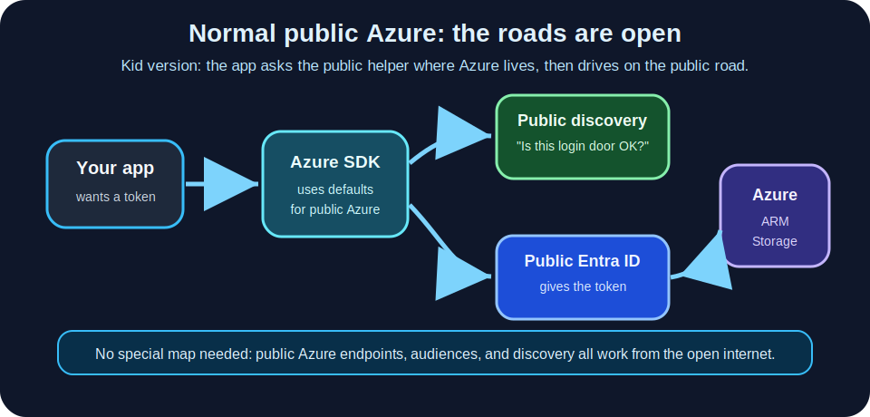
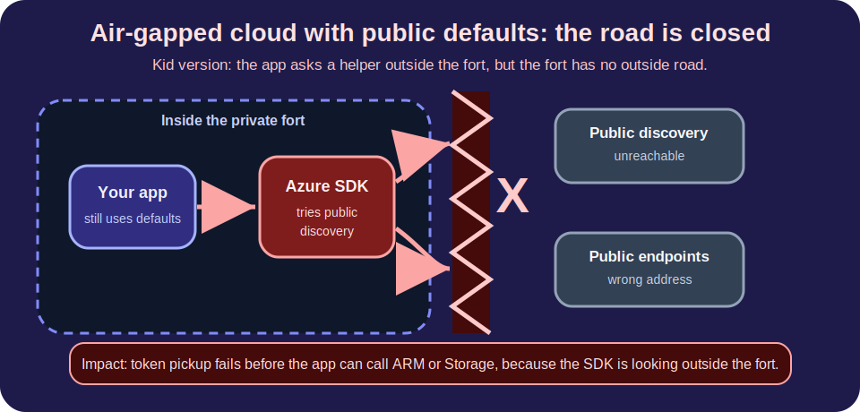
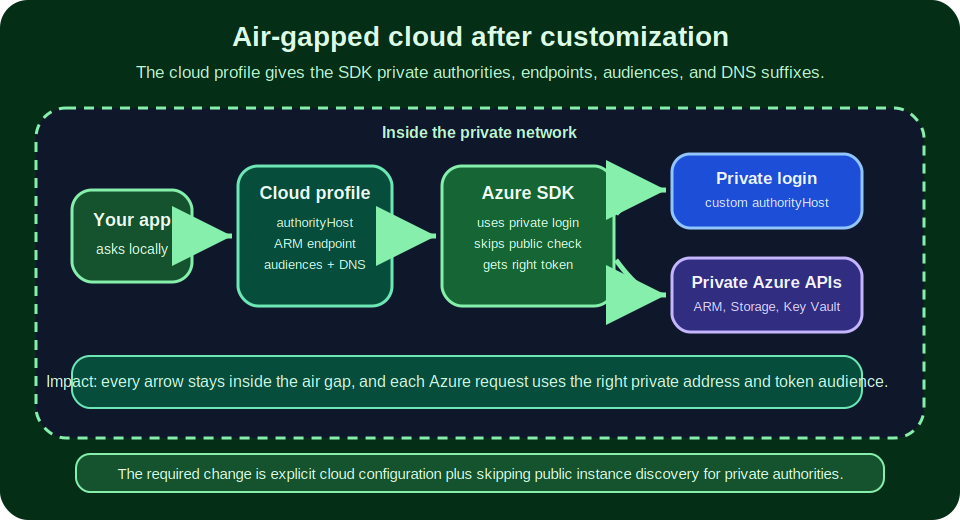

# Air-Gap Flow Impact

This page explains the required air-gap changes with simple pictures.

In kid terms: a normal Azure app is like a kid walking around a city with public street signs. An air-gapped cloud is like a private fort with its own signs and locked outside gates. The app must carry the fort's private map.

## 1. Normal public Azure

The default Azure SDK path works because the app can reach public Microsoft discovery, public sign-in, and public Azure service endpoints.

## 2. Air-gapped cloud without the changes

The app is inside the private fort, but the SDK still tries to ask a public discovery service and use public-style addresses. The outside road is closed, so token pickup fails before ARM or Storage calls can work.

## 3. Air-gapped cloud with the required changes

The app now carries a cloud profile: the private sign-in door, private management endpoint, private token audiences, and service DNS suffixes. For custom/private authorities, the credential factory also skips public instance discovery.

## What each required change does

| Required setting | Kid version | Flow impact |
|------------------|-------------|-------------|
| `authorityHost` | Use the fort's sign-in door. | Credentials ask the private/cloud-specific identity endpoint instead of a public login host. |
| `disableInstanceDiscovery: true` | Do not ask the outside city if the fort's door is real. | MSAL skips the public instance-discovery call that air-gapped networks cannot reach. |
| `resourceManagerEndpoint` | Use the fort's control room address. | ARM URLs are built for Azure Stack Hub, Secret, Top Secret, or the custom cloud. |
| `resourceManagerAudience` and `serviceAudiences` | Ask for a hall pass for the exact room you are visiting. | Tokens are scoped to the private ARM, Storage, or Key Vault audience instead of public Azure defaults. |
| `serviceDnsSuffixes` | Put the right room name on the fort map. | Storage, Key Vault, SQL, and registry hostnames are built with the private cloud suffixes. |
| `AUTH_MODE` | Pick the right kind of badge. | Local dev can use Azure CLI or device code; deployed workloads should use managed identity or workload identity when available. |

## The short version

For air-gapped Azure environments, the biggest change is that the SDK cannot guess from public Azure defaults. Give it the private map through a cloud profile, then keep all token and Azure service calls on the server side.
